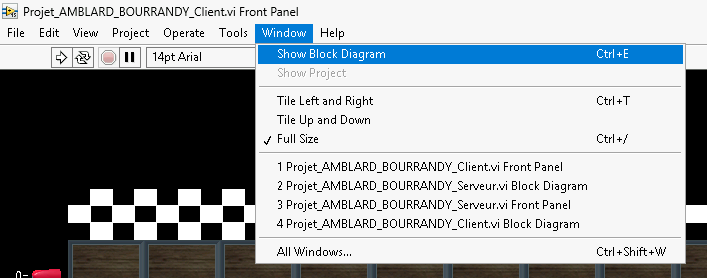
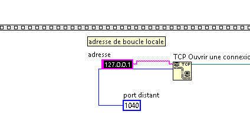

# ♟️ Quoridor - Labview

Adaptation informatique du jeu de plateau Quoridor sur Labview. 

---

# 🎯 Principe

Pour chacun des joueurs, le but est d'atteindre la ligne d'arrivée à l'autre bout du plateau. Pour cela, à chacun de ses tours, le joueur peut soit se déplacer d'une case ou alors poser un mur afin d'entraver l'avancée de son adversaire. 

Lors d'un déplacement, le joueur ne peut ni franchir de mur, ni sortir du plateau et encore moins marcher sur son adversaire. Les murs posés font 2 cases delongs et peuvent être placer à l'horizontal ou à la verticale. 

Il convient d'éviter d'enfermer son adversaire ou de bloquer tout chemin possible à son adversaire afin de ne pas casser le fun... 

---

# 🏁 Utilisation

## Configuration
Chacun des 2 joueurs devra lancer une version différente du programme. L'un la [version server](/quoridor_server.vi) et l'autre la [version client](/quoridor_client.vi). 

Afin de relier les 2 instances, il est nécessaire de récupérer l'adresse IP locale de l'ordinateur qui héberge la version server. Pour cela, entrez dans l'invité de commande : 

~~~bash
ipconfig
~~~

Reportez alors cette adresse IP dans le block diagramm de l'instance client tel que (exemple avec l'adresse 127.0.0.1) : 


<p align="center">
   
</p>

<p align="center">
   
</p>

Après cela, les programmes peuvent être lancés et le jeu peut démarrer. 

---

# 📁 Structure du projet

```
quoridor-labview/
│
├── quoridor_server.vi           # Instance serveur
├── quoridor_client.vi           # Instance client  
├── assets/                      # Illusrations utilisées par le jeu
├── images/                      # Illusrations pour le readme
├── .gitignore
├── README.md
└── LICENSE.txt
```

---
# 👨‍🏭 Auteurs

**Macéo Amblard**, **Pierre Bourrandy** - **ENSIL-ENSCI**

Ce projet a été réalisé dans le cadre du module d'informatique industrielle de 3ème année d'école d'ingénieurs en spécialité mécatronique. 

## Contact 
pierre.bourrandy@etu.unilim.fr *(ENSIL-ENSCI)*

https://github.com/Cnpruat/quoridor-labview *(GitHub)*

"# quoridor-labview" 
